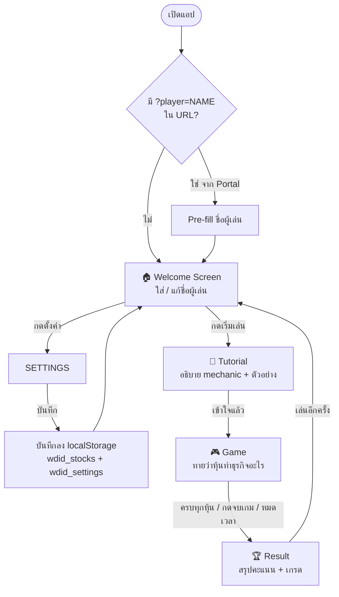
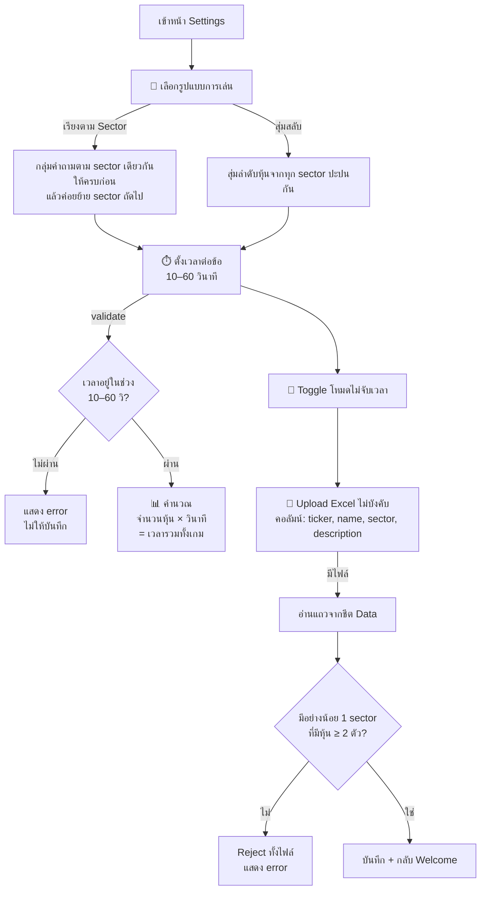
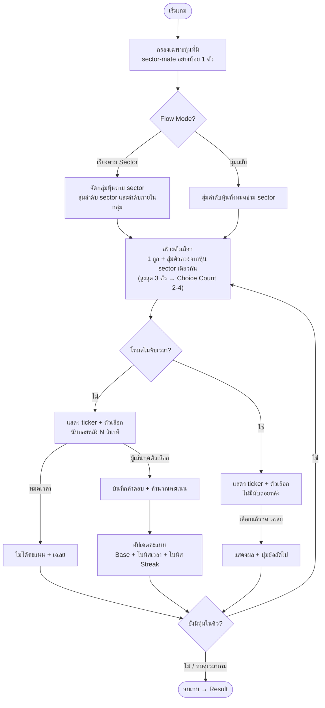
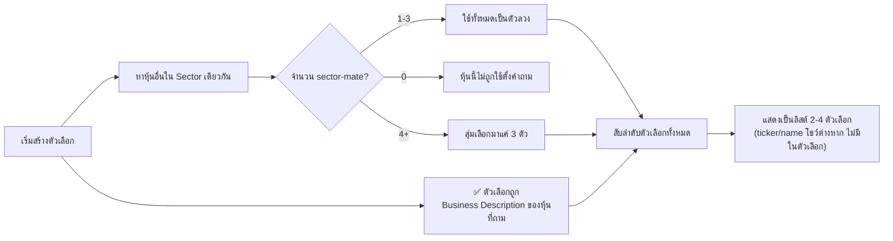
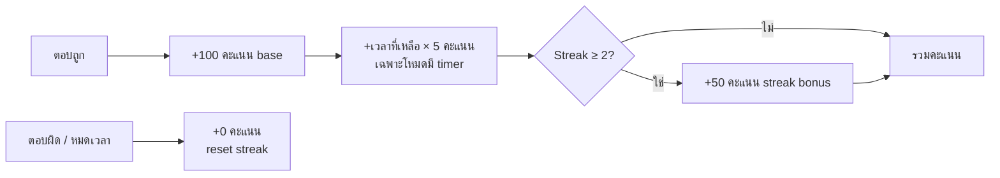

# What Does It Do? — Game Flow

## 1. App Navigation Flow

---

## 2. Settings Flow

---

## 3. Game Loop

---

## 4. Distractor Selection

---

## 5. Score System

Note: คะแนนเป็น flat เหมือน What-Is-Logo/Who-Am-I — ไม่ปรับตามจำนวนตัวเลือกต่อข้อ (ตัดสินใจไว้ใน `stock-us-what-does-it-do/CONTEXT.md`).
