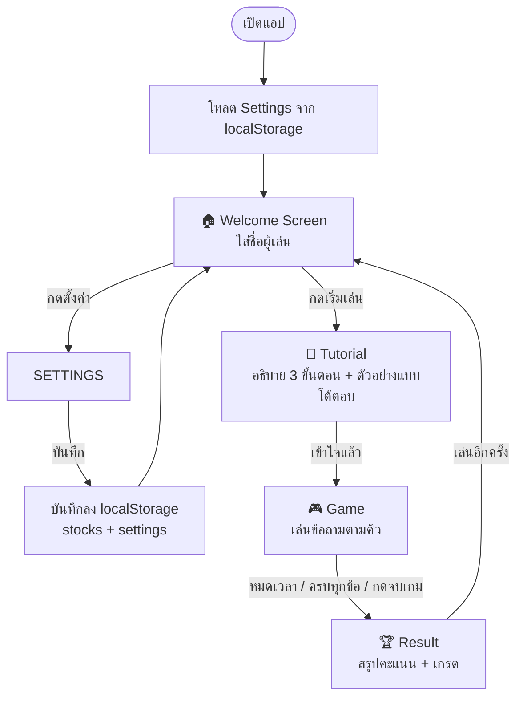
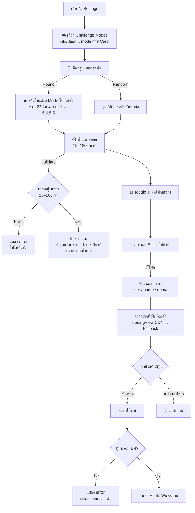
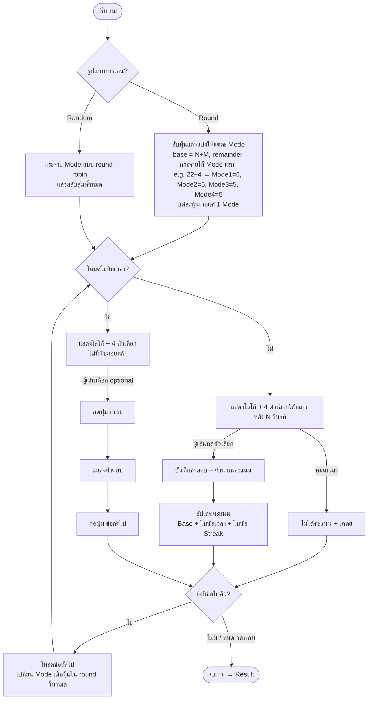
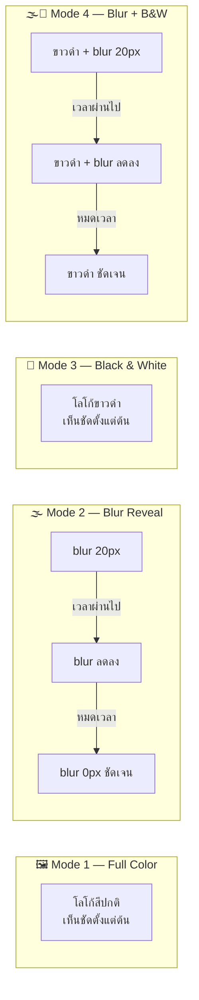
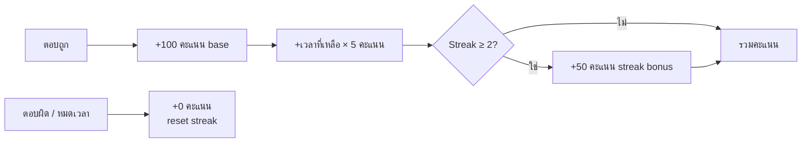

# What Is Logo — Game Flow

## 1. App Navigation Flow

```mermaid
flowchart TD
    START([เปิดแอป]) --> LOAD[โหลด Settings จาก localStorage]
    LOAD --> WELCOME[🏠 Welcome Screen\nใส่ชื่อผู้เล่น]

    WELCOME -->|กดเริ่มเล่น| TUTORIAL
    WELCOME -->|กดตั้งค่า| SETTINGS

    SETTINGS -->|บันทึก| SAVE[บันทึกลง localStorage\nstocks + settings]
    SAVE --> WELCOME

    TUTORIAL[📖 Tutorial\nอธิบาย 3 ขั้นตอน + ตัวอย่างแบบโต้ตอบ]
    TUTORIAL -->|เข้าใจแล้ว| GAME

    GAME[🎮 Game\nเล่นข้อถามตามคิว]
    GAME -->|หมดเวลา / ครบทุกข้อ / กดจบเกม| RESULT

    RESULT[🏆 Result\nสรุปคะแนน + เกรด]
    RESULT -->|เล่นอีกครั้ง| WELCOME
```

---

## 2. Settings Flow

```mermaid
flowchart TD
    S_ENTER[เข้าหน้า Settings] --> S_MODES

    S_MODES[🎮 เลือก Challenge Modes\nเปิด/ปิดแต่ละ mode ด้วย Card]
    S_MODES --> S_FLOW

    S_FLOW[🔀 เลือกรูปแบบการเล่น]
    S_FLOW -->|Round| FLOW_R[แบ่งหุ้นให้แต่ละ Mode โดยไม่ซ้ำ\ne.g. 22 หุ้น 4 mode → 6,6,5,5]
    S_FLOW -->|Random| FLOW_RND[สุ่ม Mode สลับกันทุกข้อ]

    FLOW_R --> S_TIMER
    FLOW_RND --> S_TIMER

    S_TIMER[⏱️ ตั้งเวลาต่อข้อ\n15–180 วินาที]
    S_TIMER -->|validate| S_VALIDATE{เวลาอยู่ในช่วง\n15–180 วิ?}
    S_VALIDATE -->|ไม่ผ่าน| S_ERR[แสดง error\nไม่ให้บันทึก]
    S_VALIDATE -->|ผ่าน| S_CALC

    S_CALC[📊 คำนวณ\nจำนวนหุ้น × modes × วินาที\n= เวลารวมทั้งเกม]

    S_TIMER --> S_TIMERLESS[🙌 Toggle โหมดไม่จับเวลา]
    S_TIMERLESS --> S_UPLOAD

    S_UPLOAD[📁 Upload Excel ไม่บังคับ]
    S_UPLOAD -->|มีไฟล์| S_PARSE[อ่าน columns:\nticker / name / domain]
    S_PARSE --> S_CHECK[ตรวจสอบโลโก้ทีละตัว\nTradingView CDN → Fallback]
    S_CHECK --> S_STATUS{สถานะแต่ละหุ้น}
    S_STATUS -->|✅ พร้อม| READY[พร้อมใช้งาน]
    S_STATUS -->|❌ ไม่พบโลโก้| SKIP[ไม่นำเข้าเกม]
    READY --> S_MIN{หุ้นพร้อม ≥ 4?}
    S_MIN -->|ไม่| S_ERR2[แสดง error\nต้องมีอย่างน้อย 4 ตัว]
    S_MIN -->|ใช่| S_SAVE[บันทึก + กลับ Welcome]
```

---

## 3. Game Loop

```mermaid
flowchart TD
    G_START([เริ่มเกม]) --> G_MODE{รูปแบบการเล่น?}

    G_MODE -->|Round| G_BUILD_R["สับหุ้นแล้วแบ่งให้แต่ละ Mode\nbase = N÷M, remainder กระจายให้ Mode แรกๆ\ne.g. 22÷4 → Mode1=6, Mode2=6, Mode3=5, Mode4=5\nแต่ละหุ้นเจอแค่ 1 Mode"]
    G_MODE -->|Random| G_BUILD_RND[กระจาย Mode แบบ round-robin\nแล้วสลับสุ่มทั้งหมด]

    G_BUILD_R --> G_TIMER_CHECK
    G_BUILD_RND --> G_TIMER_CHECK{โหมดไม่จับเวลา?}

    G_TIMER_CHECK -->|ใช่| G_TIMERLESS[แสดงโลโก้ + 4 ตัวเลือก\nไม่มีนับถอยหลัง]
    G_TIMER_CHECK -->|ไม่| G_TIMED[แสดงโลโก้ + 4 ตัวเลือก\นับถอยหลัง N วินาที]

    G_TIMED -->|ผู้เล่นกดตัวเลือก| G_ANSWER[บันทึกคำตอบ + คำนวณคะแนน]
    G_TIMED -->|หมดเวลา| G_TIMEOUT[ไม่ได้คะแนน + เฉลย]

    G_TIMERLESS -->|ผู้เล่นเลือก optional| G_REVEAL_BTN[กดปุ่ม เฉลย]
    G_REVEAL_BTN --> G_SHOW[แสดงคำตอบ]
    G_SHOW --> G_NEXT_BTN[กดปุ่ม ข้อถัดไป]

    G_ANSWER --> G_SCORE[อัปเดตคะแนน\nBase + โบนัสเวลา + โบนัส Streak]
    G_TIMEOUT --> G_NEXT
    G_SCORE --> G_NEXT
    G_NEXT_BTN --> G_NEXT

    G_NEXT{ยังมีข้อในคิว?}
    G_NEXT -->|ใช่| G_BUILD2[โหลดข้อถัดไป\nเปลี่ยน Mode เมื่อหุ้นใน round นั้นหมด]
    G_BUILD2 --> G_TIMER_CHECK
    G_NEXT -->|ไม่มี / หมดเวลาเกม| G_END([จบเกม → Result])
```

---

## 4. Challenge Modes

```mermaid
flowchart LR
    subgraph MODE1["🖼️ Mode 1 — Full Color"]
        M1[โลโก้สีปกติ\nเห็นชัดตั้งแต่ต้น]
    end

    subgraph MODE2["🌫️ Mode 2 — Blur Reveal"]
        M2A[blur 20px] -->|เวลาผ่านไป| M2B[blur ลดลง]
        M2B -->|หมดเวลา| M2C[blur 0px ชัดเจน]
    end

    subgraph MODE3["🖤 Mode 3 — Black & White"]
        M3[โลโก้ขาวดำ\nเห็นชัดตั้งแต่ต้น]
    end

    subgraph MODE4["🌫️🖤 Mode 4 — Blur + B&W"]
        M4A[ขาวดำ + blur 20px] -->|เวลาผ่านไป| M4B[ขาวดำ + blur ลดลง]
        M4B -->|หมดเวลา| M4C[ขาวดำ ชัดเจน]
    end
```

---

## 5. Score System

```mermaid
flowchart LR
    ANS[ตอบถูก] --> BASE[+100 คะแนน base]
    BASE --> TIME_BONUS[+เวลาที่เหลือ × 5 คะแนน]
    TIME_BONUS --> STREAK{Streak ≥ 2?}
    STREAK -->|ใช่| STREAK_BONUS[+50 คะแนน streak bonus]
    STREAK -->|ไม่| TOTAL[รวมคะแนน]
    STREAK_BONUS --> TOTAL

    ANS_WRONG[ตอบผิด / หมดเวลา] --> ZERO[+0 คะแนน\nreset streak]
```
