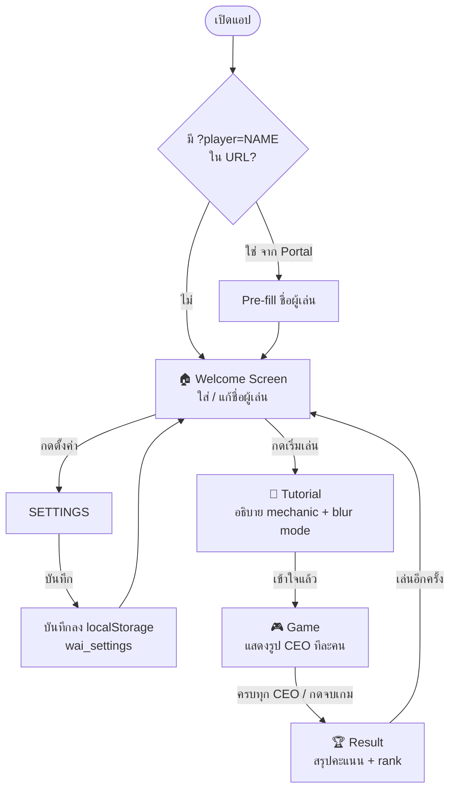
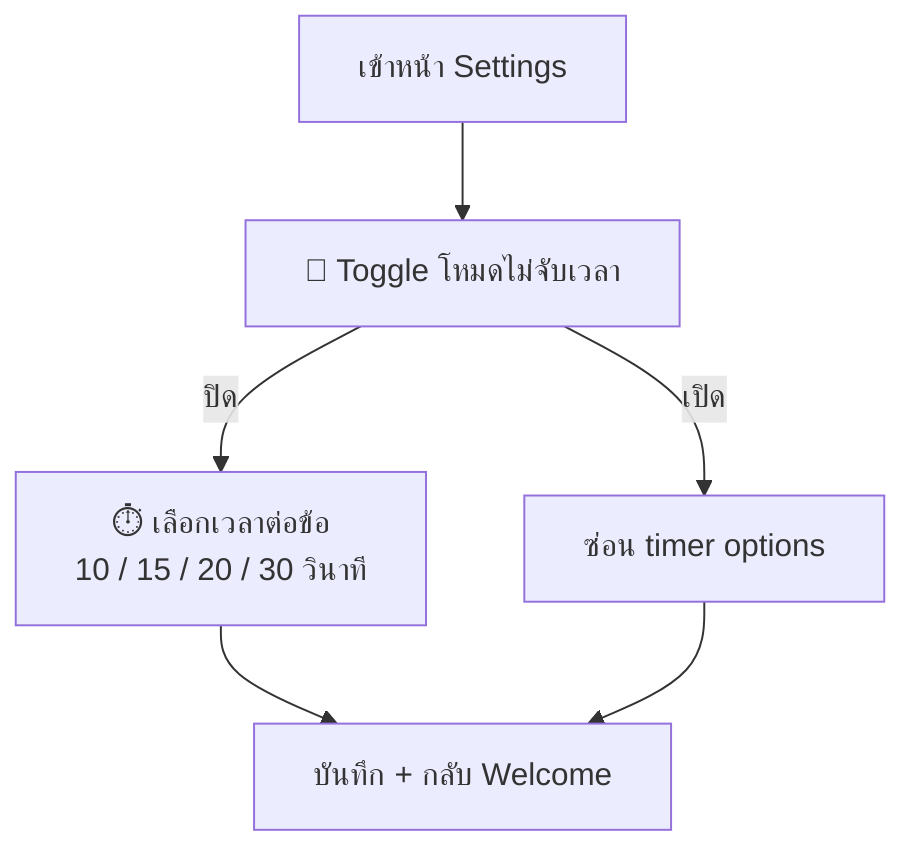
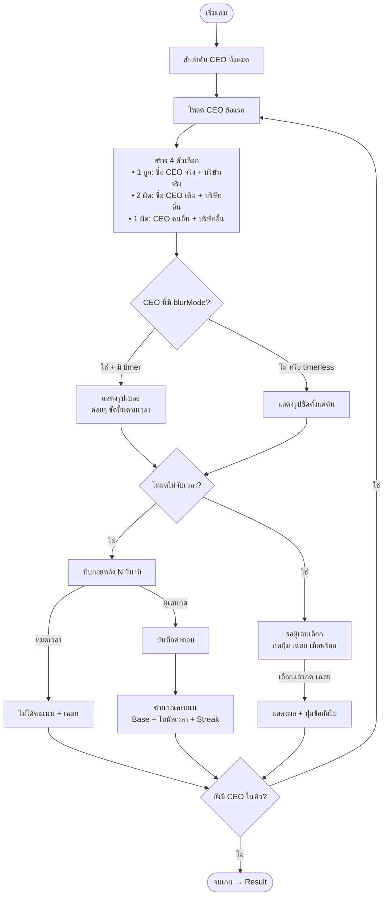
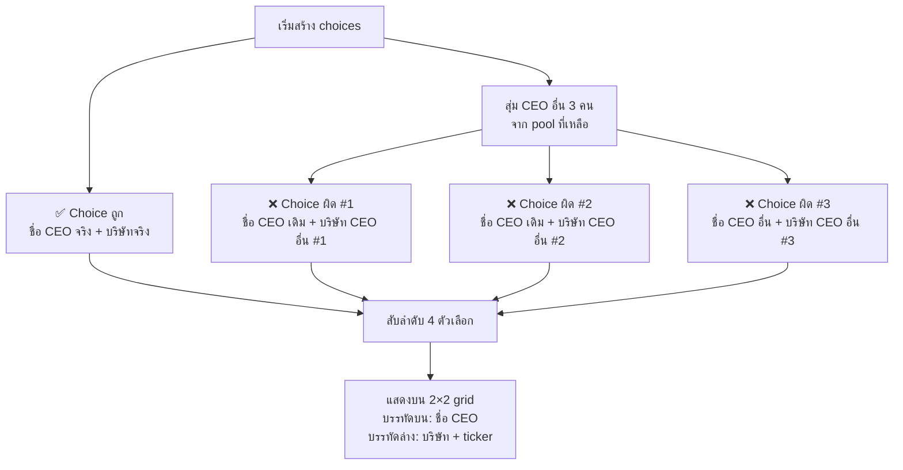
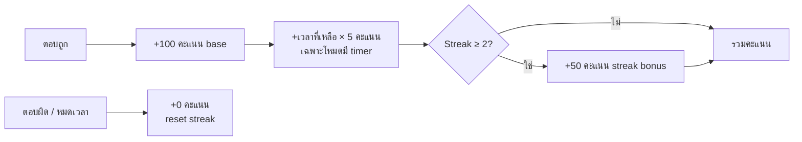

# Who Am I? — Game Flow

## 1. App Navigation Flow

```mermaid
flowchart TD
    START([เปิดแอป]) --> PARAM{มี ?player=NAME\nใน URL?}
    PARAM -->|ใช่ จาก Portal| PREFILL[Pre-fill ชื่อผู้เล่น]
    PARAM -->|ไม่| WELCOME
    PREFILL --> WELCOME[🏠 Welcome Screen\nใส่ / แก้ชื่อผู้เล่น]

    WELCOME -->|กดเริ่มเล่น| TUTORIAL
    WELCOME -->|กดตั้งค่า| SETTINGS

    SETTINGS -->|บันทึก| SAVE[บันทึกลง localStorage\nwai_settings]
    SAVE --> WELCOME

    TUTORIAL[📖 Tutorial\nอธิบาย mechanic + blur mode]
    TUTORIAL -->|เข้าใจแล้ว| GAME

    GAME[🎮 Game\nแสดงรูป CEO ทีละคน]
    GAME -->|ครบทุก CEO / กดจบเกม| RESULT

    RESULT[🏆 Result\nสรุปคะแนน + rank]
    RESULT -->|เล่นอีกครั้ง| WELCOME
```

---

## 2. Settings Flow

```mermaid
flowchart TD
    S_ENTER[เข้าหน้า Settings] --> S_TIMERLESS

    S_TIMERLESS[🙌 Toggle โหมดไม่จับเวลา]
    S_TIMERLESS -->|เปิด| TIMERLESS_ON[ซ่อน timer options]
    S_TIMERLESS -->|ปิด| S_TIME

    S_TIME[⏱️ เลือกเวลาต่อข้อ\n10 / 15 / 20 / 30 วินาที]
    S_TIME --> S_SAVE[บันทึก + กลับ Welcome]
    TIMERLESS_ON --> S_SAVE
```

---

## 3. Game Loop

```mermaid
flowchart TD
    G_START([เริ่มเกม]) --> G_SHUFFLE[สับลำดับ CEO ทั้งหมด]
    G_SHUFFLE --> G_LOAD[โหลด CEO ข้อแรก]

    G_LOAD --> G_GEN[สร้าง 4 ตัวเลือก\n• 1 ถูก: ชื่อ CEO จริง + บริษัทจริง\n• 2 ผิด: ชื่อ CEO เดิม + บริษัทอื่น\n• 1 ผิด: CEO คนอื่น + บริษัทอื่น]
    G_GEN --> G_BLUR{CEO นี้มี blurMode?}

    G_BLUR -->|ใช่ + มี timer| G_BLURRED[แสดงรูปเบลอ\nค่อยๆ ชัดขึ้นตามเวลา]
    G_BLUR -->|ไม่ หรือ timerless| G_CLEAR[แสดงรูปชัดตั้งแต่ต้น]

    G_BLURRED --> G_WAIT
    G_CLEAR --> G_WAIT

    G_WAIT{โหมดไม่จับเวลา?}
    G_WAIT -->|ใช่| G_TIMERLESS[รอผู้เล่นเลือก\nกดปุ่ม เฉลย เมื่อพร้อม]
    G_WAIT -->|ไม่| G_TIMED[นับถอยหลัง N วินาที]

    G_TIMED -->|ผู้เล่นกด| G_ANSWER[บันทึกคำตอบ]
    G_TIMED -->|หมดเวลา| G_TIMEOUT[ไม่ได้คะแนน + เฉลย]

    G_TIMERLESS -->|เลือกแล้วกด เฉลย| G_REVEAL[แสดงผล + ปุ่มข้อถัดไป]

    G_ANSWER --> G_SCORE[คำนวณคะแนน\nBase + โบนัสเวลา + Streak]
    G_TIMEOUT --> G_NEXT
    G_SCORE --> G_NEXT
    G_REVEAL --> G_NEXT

    G_NEXT{ยังมี CEO ในคิว?}
    G_NEXT -->|ใช่| G_LOAD
    G_NEXT -->|ไม่| G_END([จบเกม → Result])
```

---

## 4. Choice Generation

```mermaid
flowchart TD
    GEN[เริ่มสร้าง choices] --> CORRECT[✅ Choice ถูก\nชื่อ CEO จริง + บริษัทจริง]
    GEN --> POOL[สุ่ม CEO อื่น 3 คน\nจาก pool ที่เหลือ]

    POOL --> WRONG1[❌ Choice ผิด #1\nชื่อ CEO เดิม + บริษัท CEO อื่น #1]
    POOL --> WRONG2[❌ Choice ผิด #2\nชื่อ CEO เดิม + บริษัท CEO อื่น #2]
    POOL --> WRONG3[❌ Choice ผิด #3\nชื่อ CEO อื่น + บริษัท CEO อื่น #3]

    CORRECT --> SHUFFLE_C[สับลำดับ 4 ตัวเลือก]
    WRONG1 --> SHUFFLE_C
    WRONG2 --> SHUFFLE_C
    WRONG3 --> SHUFFLE_C

    SHUFFLE_C --> DISPLAY[แสดงบน 2×2 grid\nบรรทัดบน: ชื่อ CEO\nบรรทัดล่าง: บริษัท + ticker]
```

---

## 5. Score System

```mermaid
flowchart LR
    ANS[ตอบถูก] --> BASE[+100 คะแนน base]
    BASE --> TIME_BONUS[+เวลาที่เหลือ × 5 คะแนน\nเฉพาะโหมดมี timer]
    TIME_BONUS --> STREAK{Streak ≥ 2?}
    STREAK -->|ใช่| STREAK_BONUS[+50 คะแนน streak bonus]
    STREAK -->|ไม่| TOTAL[รวมคะแนน]
    STREAK_BONUS --> TOTAL

    ANS_WRONG[ตอบผิด / หมดเวลา] --> ZERO[+0 คะแนน\nreset streak]
```
